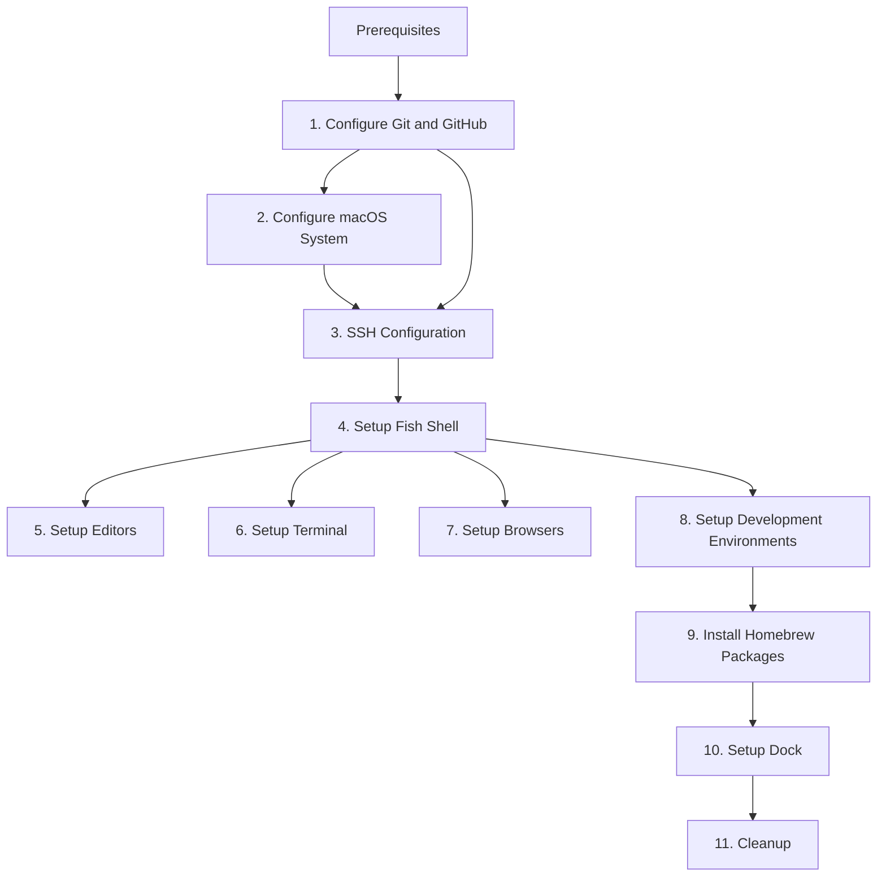

# System Setup Instructions

This document describes how to set up the system from scratch.

## Task Dependencies



**Legend:**
- **P → 1**: Prerequisites must be met before starting configuration
- **1 → 2**: macOS System configuration follows Git setup
- **2 → 3**: SSH configuration depends on Git/GitHub setup for authentication
- **4 → [5-8]**: Editor, Terminal, Browser, and Development environments rely on Fish shell configuration
- **8 → 9**: Install Homebrew packages after all development environments are set up
- **9 → 10**: Dock setup happens after package installation
- **10 → 11**: Cleanup is the final step after dock setup

## How to Proceed

**Important: Read this before executing any task.**

When executing tasks in this document:

1. **If you are confident about how to execute a task, do it.** Execute commands directly and proceed with the setup.

2. **If you are even a little unsure, use the command's help to understand the commands and flags.** Run `command --help` or `man command` to verify you understand what each flag does before proceeding.

3. **An extra command or two is better than guessing and making changes I don't want.** When in doubt, ask for clarification or verify the command's behavior before executing it. It's better to be thorough than to make irreversible changes.

**Remember:** This system will be used daily, so correctness is more important than speed. Take your time to ensure each step is done correctly.

## Prerequisites

Before starting, ensure you have the following set up:

1.  **Terminal Access**: All commands in this guide are intended to be run in the **Terminal** application (found in `/Applications/Utilities`).
2.  **Administrator Privileges**: You will need your user password for `sudo` commands to modify system settings.
3.  **Dotfiles Repository**: Ensure this repository is cloned to your home directory. If not, an agent can clone it for you using the repository URL: [vsamarth/dotfiles](https://github.com/vsamarth/dotfiles).
4.  **Homebrew**: Ensure Homebrew is installed. If not, install it from [brew.sh](https://brew.sh):
    ```bash
    /bin/bash -c "$(curl -fsSL https://raw.githubusercontent.com/Homebrew/install/HEAD/install.sh)"
    ```
    After installation, ensure Homebrew is in your PATH (check with `brew --version`).

## 1. Configure Git and GitHub

You need to configure Git and GitHub with **my** personal details. This is a critical step that must be done correctly to ensure all commits are properly attributed and authentication works seamlessly.

Ask me for these details first:
- **Name**: My full name for commit attribution
- **Email**: My email address for commit attribution
- **GitHub username**: My GitHub username

Once you have my details, configure my global gitconfig to include:
   - My name and email for commit attribution
   - Use delta as the pager for better diff visualization
   - Set nvim as the default editor
   - Configure delta settings for light mode and navigation
   - Set merge conflict style to diff3
   - Enable color-moved in diffs
   - Fix whitespace errors when applying patches
   - Sort branches by most recent commit
   - Set default branch to `main`
   - Use rebase for pull operations
   - Configure GitHub credential helper using gh auth

Configure the following git aliases exactly as specified:

| Alias | Description |
|-------|-------------|
| `slog` | View abbreviated SHA, description, and history graph of the latest 20 commits |
| `amend` | Amend the currently staged files to the latest commit |
| `tags` | Show verbose output about tags |
| `branches` | Show verbose output about branches |
| `remotes` | Show verbose output about remotes |
| `contributors` | List contributors with number of commits |
| `whoami` | Show the user email for the current repository |
| `pf` | Push with force-with-lease |
| `go` | Smart checkout - switch to branch if exists, else create it

Create a global gitignore file at `~/.gitignore` with useful defaults for the system (e.g., OS-specific files, editor temporary files, etc.)

Install Git and related tools:
- Install Git and GitHub CLI using Homebrew.
- Install Git Delta using Homebrew.

Authenticate with GitHub CLI using the web flow (run `gh auth login` and follow the browser prompts)

Verify the configuration by checking that the settings and aliases are applied correctly.

**Important:** This configuration affects all future commits and repository interactions. If you are unsure about any step, use the command's help or ask for clarification before proceeding.

## 2. Configure macOS System

Customize macOS system behavior and appearance using the `defaults` command. These settings improve usability, privacy, and performance.

**Computer Identity**
- Set the computer name, hostname, and local hostname to "spacebook".
- Configure the NetBIOS name for network identification.

**Finder Enhancements**
- Show hidden files in Finder (dotfiles).
- Show all file extensions, even for known types.
- Disable the security warning when opening applications downloaded from the internet.

## 3. SSH Configuration

Configure SSH client settings directly in `~/.ssh/config`. This ensures secure connections to remote servers and GitHub.

Check for existing SSH keys: Verify `~/.ssh/id_ed25519` or similar SSH key files exist.
If SSH keys don't exist: Ask me to generate new SSH keys. Once confirmed, verify they exist before proceeding.
If keys still don't exist after confirmation: Skip this section and proceed to the next step.

Create the SSH config file at `~/.ssh/config` with these settings:
   - Include `~/.ssh/config.private`
   - Default settings for all hosts: AddKeysToAgent yes, UseKeychain yes, IdentityFile ~/.ssh/id_ed25519, ServerAliveInterval 60, ServerAliveCountMax 3
   - GitHub host: HostName github.com, User git, IdentityFile ~/.ssh/id_ed25519, IdentitiesOnly yes
   - GitLab host: HostName gitlab.com, User git, IdentityFile ~/.ssh/id_ed25519, IdentitiesOnly yes

Set proper permissions on the SSH directory and config file (700 for directory, 600 for files)

Important: SSH private keys should never be committed to any repository.

Verification: Test SSH connection to GitHub.

## 4. Setup Shell (Fish)

Install Fish and related tools:
- `fish`
- `eza`
- `fd`
- `fzf`
- `ripgrep`
- `zoxide`
- `bat`
- `lazygit`
- `jq`

Configure Fish shell as the default shell.

Create the Fish config file at `~/.config/fish/config.fish` so it matches the tracked config in this repository.

### Environment Variables

Set these variables at shell startup:

| Variable | Value | Purpose |
|----------|-------|---------|
| `VISUAL` | `code` | Default GUI editor |
| `EDITOR` | `nvim` | Default terminal editor |
| `LANG` | `en_US.UTF-8` | Locale and encoding |
| `CLAUDE_CODE_ATTRIBUTION_HEADER` | `0` | Disable Claude Code attribution header |

### Integrations

Load the shell integrations used by this config:

- Create `~/.config/fish/config.local.fish` and source it from `config.fish`.
- Run Homebrew shell initialization with `brew shellenv`.
- Source Cargo environment setup from `~/.cargo/env.fish`.
- Initialize `zoxide` for smarter directory navigation.
- Initialize `direnv` for directory-local environment variables.
- Set `FZF_DEFAULT_OPTS` to use a bordered reverse layout with the `❯` prompt.
- Source the Fish completions from `fzf --fish`.

### Aliases and Abbreviations

Add the following conveniences:

**General**

| Alias | Expansion |
|-------|-----------|
| `e` | `$EDITOR` |
| `vim` | `$EDITOR` |
| `hosts` | `sudo $EDITOR /etc/hosts` |
| `reload` | re-source `~/.config/fish/config.fish` |

**Navigation and listings**

| Alias | Expansion |
|-------|-----------|
| `ls` | `eza -A --sort type` |
| `ll` | `eza -A --long --sort type --git --no-user --no-time` |
| `cat` | `bat` |
| `fabric` | `fabric-ai` |
| `lg` | `lazygit` |

**Git**

| Alias | Expansion |
|-------|-----------|
| `g` | `git` |
| `ga` | `git add` |
| `gc` | `git commit` |
| `gcm` | `git checkout main` |
| `gco` | `git go` |
| `gd` | `git diff` |
| `gl` | `git slog` |
| `gp` | `git push` |
| `gs` | `git status -s` |

**GitHub CLI**

| Alias | Expansion |
|-------|-----------|
| `ghb` | `gh browse` |
| `ghco` | `gh pr checkout` |
| `ghpc` | `gh pr create` |
| `ghpw` | `gh pr view --web` |
| `ghrv` | `gh repo view` |

**Homebrew**

| Alias | Expansion |
|-------|-----------|
| `br` | `brew` |
| `bri` | `brew install -q` |
| `brls` | `brew list` |
| `brui` | `brew uninstall -q` |
| `brup` | `brew update -q && brew upgrade -q && brew cleanup -q` |

**Install Fisher plugins:**

| Plugin | Description |
|--------|-------------|
| `jorgebucaran/autopair.fish` | Auto-pair brackets and quotes |
| `jorgebucaran/fisher` | Plugin manager |
| `jorgebucaran/hydro` | Prompt theme |
| `nickeb96/puffer-fish` | Fish prompt enhancement |

Note: `zoxide` and `fzf` are installed via Homebrew and initialized from `config.fish`, not through Fisher.

## 5. Setup Editors

Install terminal applications:
- `ghostty`
- `zellij`

### Ghostty

Configure Ghostty with Gruvbox Light Hard for light mode, Gruvbox Dark Hard for dark mode, Option-as-Alt shortcuts, and JetBrains Mono as the default font.

### Zellij

Configure Zellij with the `gruvbox-dark` theme. Add the following Fish abbreviations in `~/.config/fish/config.fish`:

| Alias | Expansion |
|-------|-----------|
| `zl` | `zellij` |
| `zla` | `zellij attach --create` |
| `zlds` | `zellij attach --create (basename (pwd))` |
| `zlls` | `zellij list-sessions` |

## 6. Setup Terminal

Install editors:
- Install Visual Studio Code: `brew install visual-studio-code`
- Install Neovim: `brew install neovim`

### VS Code

Configure VS Code settings directly.

Create the VS Code user settings directory: `mkdir -p ~/Library/Application\ Support/Code/User`
Create the settings file at `~/Library/Application\ Support/Code/User/settings.json` with these settings:
   - Editor: breadcrumbs disabled, accessibility support off, cursor blinking solid, folding enabled, font family "Jetbrains Mono", font ligatures enabled, fontSize 13, guides indentation disabled, minimap disabled, render whitespace selection
   - Explorer: confirm delete and drag drop disabled
   - Extensions: asvetliakov.vscode-neovim affinity 1
   - Files: associations for *.css to tailwindcss, auto save after delay
   - Git: autofetch enabled, confirm sync disabled, GitHub pull requests push branch always
   - Svelte: enable typescript plugin
   - Telemetry: disabled
   - Terminal: persistent sessions disabled, inherit env disabled, shell integration disabled
   - TypeScript: update imports on file move always
   - VS Icons: don't show new version message
   - Window: auto detect color scheme
   - Workbench: activity bar hidden, editor tabs single, icon theme vscode-icons, preferred dark theme Gruvbox Dark Hard, preferred light theme Gruvbox Light Hard, side bar location right, startup editor none
   - C/C++: clang format fallback style LLVM
   - TypeScript: default formatter vscode.typescript-language-features
   - Claude Code: preferred location panel

### VS Code Extensions

Install essential VS Code extensions for development workflow.

Install these extensions using the VS Code Extensions panel or CLI:
- Neovim integration: asvetliakov.vscode-neovim
- Theme & icons: vscode-icons-team.vscode-icons, jdunkerley.gruvbox-theme
- Language support: rust-lang.rust-analyzer, ms-python.python, ms-python.vscode-pylance, golang.go, vadimcn.vscode-lldb, bradlc.vscode-tailwindcss
- Git & GitHub: github.vscode-pull-request-github, eamodio.gitlens
- Other tools: yzhang.markdown-all-in-one, codeandrun.prettier-vscode, ms-vscode-remote.remote-ssh

### Neovim

Configure Neovim directly.

Create the Neovim configuration directory: `mkdir -p ~/.config/nvim`
Copy the Neovim configuration files (init.lua, lazy-lock.json, .stylua.toml) to `~/.config/nvim/`

Note: The Neovim configuration is complex. For simplicity, copy the entire configuration from the dotfiles repository rather than recreating it manually.

## 7. Setup Firefox


**Resources:**
- [Betterfox](https://github.com/yokoffing/Betterfox) - Firefox privacy configuration
  - [Common Overrides](https://github.com/yokoffing/Betterfox/blob/master/Common-overrides.md) - Essential settings to apply
  - [Optional Hardening](https://github.com/yokoffing/Betterfox/blob/master/Optional-hardening.md) - Advanced security settings
- [Firefox Documentation](https://support.mozilla.org/en-US/products/firefox) - Official Firefox help

Install Firefox from homebrew and configure Firefox with Betterfox privacy settings using the following steps:

- Initialize Firefox profile (open Firefox once to create profile directory)
- Find the default-release profile directory
- Apply Betterfox user.js configuration, including:
  - **Common Overrides**: Essential privacy and performance settings
  - **Optional Hardening**: Advanced security settings (recommended)
- Set Firefox as the default browser

**Note:** An agent can handle this automatically once the profile directory exists.

## 8. Setup Development Environments

Install development tools and configure environments for Rust, Python, Go, and Node.js.

### Rust

- Install Rust via rustup: `curl --proto '=https' --tlsv1.2 -sSf https://sh.rustup.rs | sh`
- Install the following tools using cargo:
    * `cargo-edit`: Manage Cargo.toml dependencies
    * `cargo-update`: Update installed binaries
    * `cargo-audit`: Security vulnerability scanning
    * `cargo-outdated`: Check for outdated dependencies
    * `cargo-tree`: Visualize dependency tree
    * `cargo-expand`: Show macro-expanded code

### Python

- Install pipx from Homebrew: `brew install pipx`
- Ensure pipx is in PATH: `pipx ensurepath`
- Install tools using pipx:
    * `uv`: Fast Python package installer and resolver
    * `ruff`: Extremely fast Python linter and formatter

### Go

- Install Go from Homebrew: `brew install go`
- Create workspace directories: `~/go/bin`, `~/go/src`, `~/go/pkg`

### Node.js

- Install Node.js from Homebrew: `brew install node`
- Install Bun: `npm install -g bun`

### Fish Configuration

- Ensure all development tools just set up are accessible in Fish shell
- If not, add them using `fish_add_path` in Fish config:
    * `~/.cargo/bin` (Rust/Cargo tools)
    * `~/go/bin` (Go binaries)
    * `~/.local/bin` (Python pipx and npm global tools)

**Verification:**
- Start a new Fish shell and confirm it launches without errors
- Verify `cargo --version`, `go version`, `uv --version`, `bun --version`

## 9. Install Homebrew Packages

Install all formulas (command-line tools) and casks (GUI applications).

### Formulas (CLI Tools)

These tools are grouped by their primary function to make the list easier to scan.

| Package | Purpose |
|---------|---------|
| `age` | Encryption |
| `claude-code` | AI tool |
| `croc` | Secure file transfer |
| `docker` | Container runtime |
| `direnv` | Directory-local environment management |
| `gemini-cli` | AI tool |
| `topgrade` | System upgrade automation |
| `wget` | File downloading |
| `yt-dlp` | Media downloading |

### Casks (GUI Applications)

| Package | Purpose |
|---------|---------|
| `discord` | Messaging app |
| `docker` | Container runtime |
| `font-jetbrains-mono` | Monospace font |
| `iina` | Media player |
| `keepingyouawake` | Prevents system sleep |
| `monitorcontrol` | External monitor brightness and volume control |
| `proton-drive` | Privacy-focused storage |
| `proton-mail` | Privacy-focused email |
| `protonvpn` | Privacy-focused VPN |
| `raycast` | Spotlight replacement |
| `rectangle` | Window management |
| `shottr` | Screenshot tool |
| `spotify` | Music streaming |
| `telegram` | Messaging app |
| `todoist-app` | Task management |
| `whatsapp` | Messaging app |

Install all the above packages using Homebrew. This is a common task that an agent can handle automatically.

## 10. Setup Dock

Configure the Dock to show specific apps in a particular order using `dockutil`.

**Apps to add (in order):**

| Order | Application |
|-------|-------------|
| 1 | Firefox |
| 2 | Visual Studio Code |
| 3 | Ghostty |
| 4 | Whatsapp |
| 5 | Todoist |
| 6 | Proton Mail |
| 7 | Calendar |
| 8 | ChatGPT |
| 9 | Spotify |

Remove all existing Dock items
Add each app to the Dock (checking both `/Applications` and `/System/Applications`)
Restart the Dock

Note: This is a common task that an agent can handle automatically.

## 11. Cleanup

Clean up Homebrew cache and temporary files.

Run `brew cleanup` to remove old versions and cache

Note: This is a common task that an agent can handle automatically.
